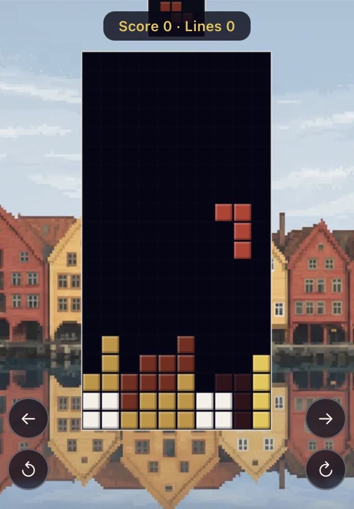

# Bryggen Blocks

A Tetris game inspired by the colorful wooden buildings of [Bryggen](https://en.wikipedia.org/wiki/Bryggen) in Bergen, Norway.

<p align="center">
  
</p>

## Features

- **Standard 10×20 board** with all 7 tetrominoes
- **SRS wall kicks** — proper rotation handling against walls
- **Ghost piece** — shows where the piece will land
- **Next piece preview** — see what's coming
- **Touch-friendly controls** — on-screen left/right/rotate buttons, plus a bottom-row drop zone for hard drop
- **Bryggen-themed art** — background with colorful Bergen wharf buildings, harbor water, and a moody Nordic sky
- **PWA** — installable on your home screen, works offline via service worker
- **Responsive** — adapts to screen size (designed for mobile portrait)

## How to Play

The game is hosted here:

https://only1thor.github.io/bryggen-blocks

| Control | Action |
|---|---|
| ← button | Move left |
| → button | Move right |
| ↺ button | Rotate counter-clockwise |
| ↻ button | Rotate clockwise |
| Tap bottom 3 rows of board | Hard drop |
| Tap board (game over) | Restart |

Clear lines to score points. Game over when pieces stack to the top.

## Tech Stack

Vanilla JavaScript, HTML5 Canvas, CSS — no frameworks or dependencies. A single-page app served from static files.

## Running Locally

Any static file server works:

```sh
cd bryggen-blocks
python3 -m http.server 8080
# or: npx serve .
```

Open `http://localhost:8080` in your browser.

## License

MIT
